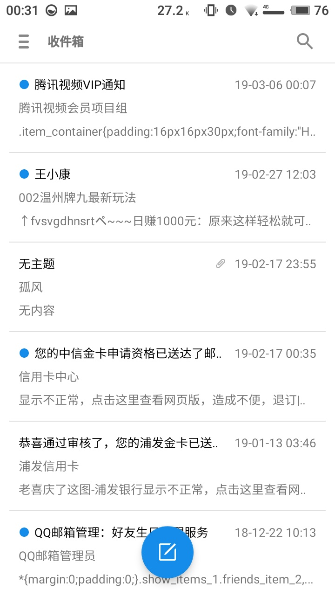

# email

  
  
  
  
  
  
  
  
  
  
  

## 总结

这个项目最初就是帮别人写的，但自己还是前前后后花了一个月的时间！

刚开始的时候，什么也不懂，于是就是查找资料，各种研究，关于javaMail、邮件格式、如何解析、附件怎么处理之类的，一点一点的弄个大概，犹记得自己当初花了两天的
时间，看完了张孝祥的《Java邮件开发详解》，那是一本07年的老书了，不过关于邮件讲解的书好像很少，当初自己就只找到这一本书，虽然老，而且还是讲的还是web端
如何处理邮件的，不过对我的帮助还是很大，至少让我明白了邮件整体的格式是怎么样的，这对于我后来如何解析邮件有很大的帮助，虽然我写的解析代码还是有着题。。。

UI方面，主要是参考自己魅族手机自带的邮件APP！

目前的邮件基本上都是html格式的了，有的会同时支持html格式和纯文本格式，所以在得到一个字符串之后，通过webView来显示，效果比我想象中的好多了！记得自己最自
豪的是，如果只是一个单纯的附件图片，魅族的邮件App会将其加入到文本区域，当初自己为了把图片显示出来，记得自己拦截了webView的某个方法，然后自己请求加载,
最后实现成功显示出来！

至于附件，则可以通过一个字段判断其是否是附件，点击下载的时候，可以获取到链接，从而获取到流！但当初不知道怎么弄的，下载附件的速度非常慢？？？

至于发送邮件，自己对于html也是不太懂，所以就只有一个纯文本的邮件发送了！

最后由于时间原因，自己也就只实现的QQ邮件和163邮件的发送和接收！

这个项目对于自己最大的收获，就是对邮件格式的理解，还有就是初次尝试了下MVP模式，不过自己的MVP模式好像有着极大的问题，自己其次好像有些错误理解。。。。。
